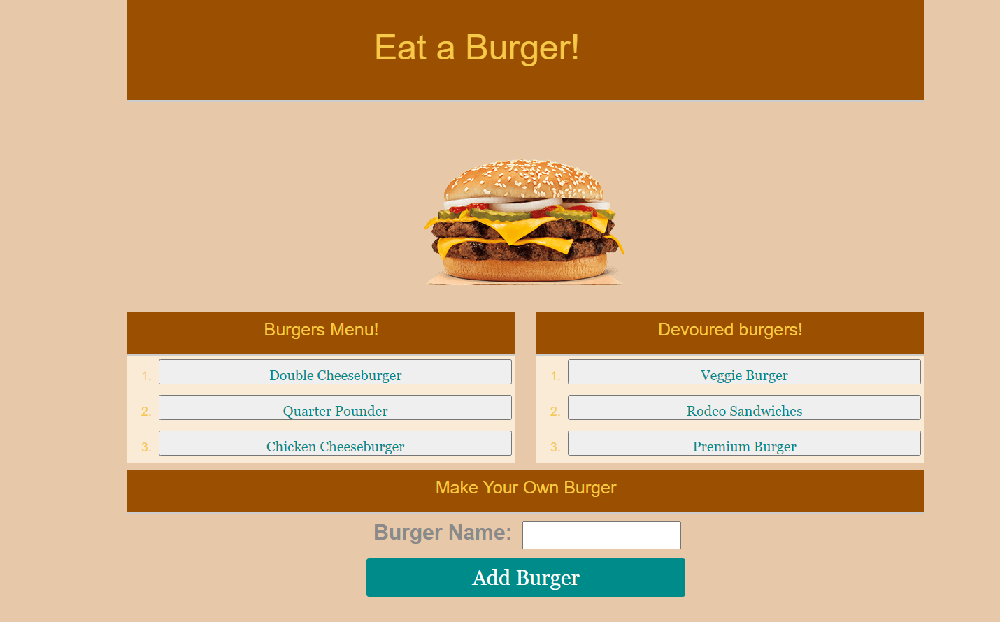

# Burger

## Description
This is a restaurant app that lets users input the names of burgers they'd like to eat, then the burger will be displayed in the menu list on the left side of the page, waiting to be devoured. The app was created with MySQL, node.js, and handlebars. The application follows the MVC design pattern.

- The user enters the burger name and clicks on the add button, it displays the burger on the left side of the page.   
- When the user clicks on the burger from the menu to devour it, the burger moves to the right side of the page waiting to be devoured.

The app stores all the added burgers to the database.

## Installation
```
npm install
   mysql
   express
   express-handlebars
```


[Deployed App in Heroku](https://sleepy-reaches-91541.herokuapp.com/)



## Instructions
### App Setup
1. Create a Github repo called burger and clone it to your computer.
1. Make a package.json file by running npm init from the command line.

## License
[](https://opensource.org/licenses/MIT)

## Technologies Used
The following technologies and tools were used:
- CSS
- Handlebars
- JavaScript
- Node.js
- MySQL Workbench

## Questions
For any other questions, please send me an email at: isasanyang1986@yahoo.co.uk
